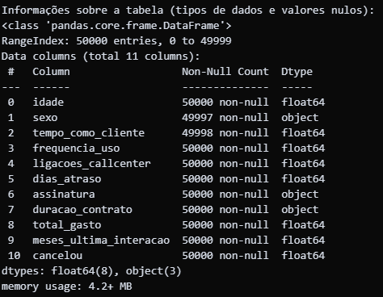

Python Insights - Analisando Dados com Python

### **Case - Análise de Cancelamento de Clientes**

Você foi contratado por uma empresa com mais de 800 mil clientes para um projeto de Dados. Recentemente, a empresa notou que grande parte de sua base de clientes está inativa, indicando um alto índice de cancelamentos.

Para melhorar seus resultados, o objetivo é entender os principais motivos por trás desses cancelamentos e identificar as ações mais eficientes para reduzir essa taxa.

---

**Base de Dados:**

Os arquivos necessários para a análise estão disponíveis na pasta do Google Drive:
[Base de dados e arquivos:](https://drive.google.com/drive/folders/1uDes7ePdkHiraJmiyeZ-w5lfc8K6NYFZ?usp=drive_link)

# Projeto de Análise: Fatores de Cancelamento de Clientes

### **Passo a Passo da Análise**

1.  **Importação e Visualização:** Carregar os dados e fazer um primeiro diagnóstico.
2.  **Tratamento de Dados:** Corrigir inconsistências e valores ausentes.
3.  **Análise Exploratória:** Entender as principais características dos clientes.
4.  **Análise de Cancelamentos:** Investigar a relação entre as colunas e o cancelamento.

---

### **Análise das causas dos cancelamentos**

1.  **Como as colunas da base impactam no cancelamento:** Gráficos com os motivos do Cancelamento por Categorias.

---

### **Simular o impacto das ações de melhoria**

1.  **Contagem antes da Simulação:** Total de Clientes.

2.  **Calcular a taxa de cancelamento original:** Taxa de Cancelamentos.

---

### **Taxa de Cancelamento Original**

---

### **Taxa de Cancelamento Após a Simulação**

